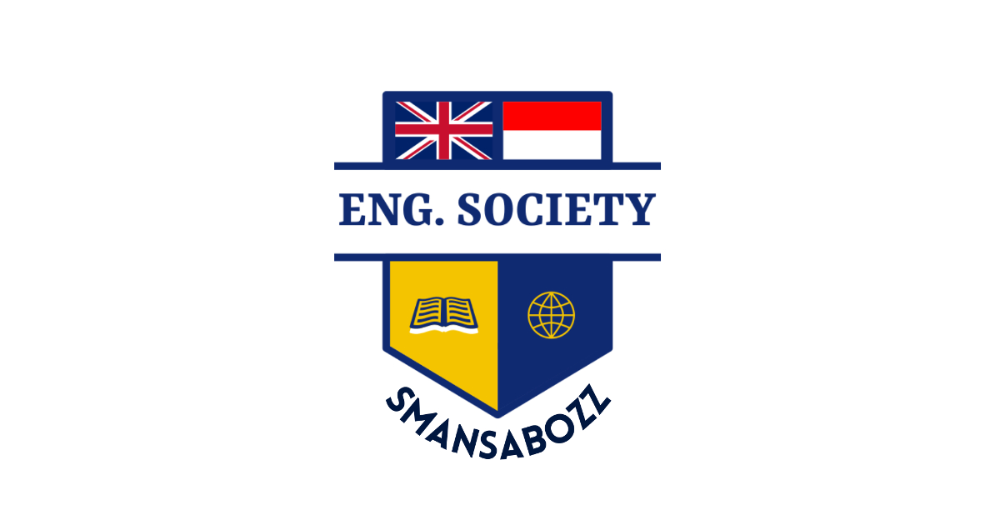

# 🎓 ESBozz Web Project – A Full-Stack Web App for English Society-Bozz (My School Extracurricular)

A dynamic, full-featured web application built to support and showcase the activities of **English Society-Bozz**. Developed with a modern tech stack, this project includes user authentication, dynamic content management, and responsive design—optimized for real users and real-world needs.


## 🚀 Live Demo

### 📸 Homepage Screenshot 


🔗 See the [Live Site](https://english-society-bozz.vercel.app)


## 🧠 Features

- ✅ **Authentication** – Login/Logout, session handling
- 📝 **Content Management** – Simple user dashboard to create or edit events/awards
- 🧑‍🤝‍🧑 **User Roles** – Admin, Developer, Teacher, Officer, Event Maker and Student
- 📱 **UI Design** – Clean, simple and unique!
- 📱 **Responsive Design** – Fully functional across devices
- 🔍 **Search & Filtering** – Smart content searching and filtering by words, categoris, levels, titles, etc.


## 🛠️ Tech Stack

**Frontend**  
- Svelte (Sveltekit)
- TypeScript
- TailwindCSS

**Backend**  
- Node.js + Express + TypeScript
- REST API

**Database**  
- PostgreSQL with Supabase

**Other Tools**  
- Auth: Supabase JWT Auth  
- Deployment: Vercel
- Version Control: Git + GitHub

## ⚙️ Setup Instructions

1. **Clone the repo**
   ```bash
   git clone https://github.com/raulmauldihino-dev/english-society-bozz.git
   cd english-society-bozz

2. **Install dependencies**
    ```bash
    npm install

3. **Add environment variables**

    Create a .env file and set your variables (see .env.example)

4. **Start development server**
   ```bash
    npm run dev

## 📸 Screenshots
### Events Page


### Awards Page


### About Us


### Login Page


### Public User Profile Page


	
## 📌 Lessons Learned
- Deepened my understanding of **full-stack architecture**
- Implemented **role-based access** and **state management**
- Connected the **backend stacks** with the **frontend stacks**
- Understood how **Supabase JWT Auth, Access Token, Refresh Token and Middleware** as **standard web app security**
- Understood how **SSR** and **CSR** work in web programming
- Learned how to deploy and **manage environment variables** in production

## 🙋‍♀️ About Me

I'm Raul, a 2025 Graduated High School Student (also a Mechatronics Engineering Student at [EEPIS](https://pens.ac.id/) now) passionate about web development and building tools that make an impact for society. 

Made with ❤️ in Indonesia 🇮🇩

📫 Connect with me on [LinkedIn](https://linkedin.com/in/raulahmadm) or visit [rauldev.my.id](https://rauldev.my.id) to explore anything about my works!
